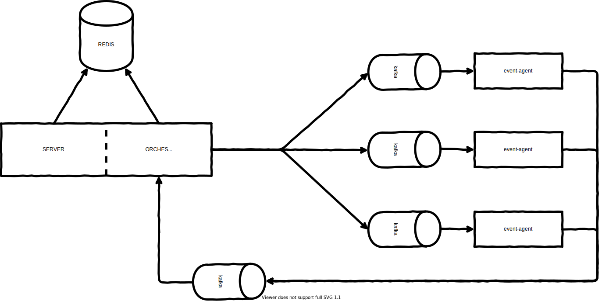
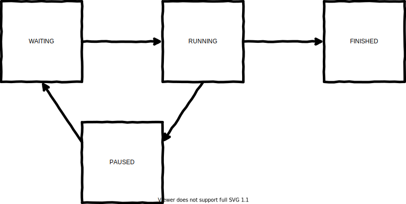

# xcute

xcute is a tool for executing jobs in a distributed manner.

## Terminology

- Job: task series
- Task: unit of execution
- Orchestrator: task dispatcher
- Worker: task executor

## Architecture

### Services

For each job processed, the orchestrator will generate all the tasks
and send them to the workers (event-agent).



### Status

When you create a job, the job waits to be run by an orchestrator.
While the job is running, you can interrupt it.



## Configuration

### Server/orchestrator

Sample configuration for the server/orchestrator:

```ini
# cat /etc/oio/sds/OPENIO/xcute-0/xcute-0.conf
# OpenIO managed
[DEFAULT]
log_level = INFO
syslog_prefix = OIO,OPENIO,xcute,0
redis_sentinel_hosts = 172.30.1.244:6012,172.30.3.73:6012,172.30.3.131:6012
redis_sentinel_name = OPENIO-master-1
namespace = OPENIO

[xcute-server]
bind_addr = 172.30.1.244
bind_port = 6400
workers = 1

[xcute-orchestrator]
orchestrator_id = 7d1c892f-99c7-5366-86d1-fd3753578e78
beanstalkd_workers_tube = oio-xcute
beanstalkd_reply_tube = oio-xcute.reply
beanstalkd_reply_addr = beanstalk://172.30.1.244:6014
```

### Worker

The worker is a specific event-agent.

Sample configuration for the event-agent:

```ini
# cat /etc/oio/sds/OPENIO/oio-event-agent-0/oio-event-handlers-xcute.conf
# OpenIO managed
[handler:xcute.tasks]
pipeline = xcute

[filter:xcute]
use = egg:oio#xcute
```

## Use

### Create a job

Here are the jobs you can create.

```shell
> openio-admin xcute rawx rebuild [SERVICE_ID]
```

```shell
> openio-admin xcute rawx decommission [SERVICE_ID]
```

The following jobs are still in a beta version.

```shell
> openio-admin xcute meta2 rebuild [SERVICE_ID]
```

```shell
> openio-admin xcute meta2 decommission [SERVICE_ID]
```

Sample:

```shell
> openio-admin xcute rawx decommission 172.30.1.244:6201
+------------------------------------+----------------------------------+
| Field                              | Value                            |
+------------------------------------+----------------------------------+
| config.params.excluded_rawx        |                                  |
| config.params.max_chunk_size       | 0                                |
| config.params.min_chunk_size       | 0                                |
| config.params.rawx_timeout         | 60.0                             |
| config.params.rdir_fetch_limit     | 1000                             |
| config.params.rdir_timeout         | 60.0                             |
| config.params.service_id           | 172.30.1.244:6201                |
| config.params.usage_check_interval | 60.0                             |
| config.params.usage_target         | 0                                |
| config.tasks_batch_size            | 32                               |
| config.tasks_per_second            | 32                               |
| errors.total                       | 0                                |
| job.ctime                          | 1584636356.71                    |
| job.id                             | 20200319164556708006-145b1fbcd5b |
| job.lock                           | rawx/172.30.1.244:6201           |
| job.mtime                          | 1584636356.71                    |
| job.request_pause                  | False                            |
| job.status                         | WAITING                          |
| job.type                           | rawx-decommission                |
| tasks.all_sent                     | False                            |
| tasks.is_total_temp                | True                             |
| tasks.last_sent                    | None                             |
| tasks.processed                    | 0                                |
| tasks.sent                         | 0                                |
| tasks.total                        | 0                                |
| tasks.total_marker                 | None                             |
+------------------------------------+----------------------------------+
```

### Track the progress of a job

```shell
> openio-admin xcute job show [JOB_ID]
```

Sample:

```shell
> openio-admin --oio-ns OPENIO xcute job show 20200319164556708006-145b1fbcd5b
+------------------------------------+----------------------------------+
| Field                              | Value                            |
+------------------------------------+----------------------------------+
| config.params.excluded_rawx        |                                  |
| config.params.max_chunk_size       | 0                                |
| config.params.min_chunk_size       | 0                                |
| config.params.rawx_timeout         | 60.0                             |
| config.params.rdir_fetch_limit     | 1000                             |
| config.params.rdir_timeout         | 60.0                             |
| config.params.service_id           | 172.30.1.244:6201                |
| config.params.usage_check_interval | 60.0                             |
| config.params.usage_target         | 0                                |
| config.tasks_batch_size            | 32                               |
| config.tasks_per_second            | 32                               |
| errors.total                       | 0                                |
| job.ctime                          | 1584636356.71                    |
| job.duration                       | 8.122920084                      |
| job.id                             | 20200319164556708006-145b1fbcd5b |
| job.lock                           | rawx/172.30.1.244:6201           |
| job.mtime                          | 1584636364.83                    |
| job.status                         | RUNNING                          |
| job.type                           | rawx-decommission                |
| results.moved_bytes                | 105790707                        |
| results.moved_chunks               | 256                              |
| tasks.processed                    | 256                              |
| tasks.processed_per_second         | 31.515760016                     |
| tasks.processed_percent            | 56.2637362637                    |
| tasks.sent                         | 256                              |
| tasks.sent_percent                 | 56.2637362637                    |
| tasks.total                        | 455 (estimated)                  |
+------------------------------------+----------------------------------+
```

### List all jobs

```shell
> openio-admin xcute job list
```

Sample:

```shell
> openio-admin --oio-ns OPENIO xcute job list
+----------------------------------+----------+-------------------+---------------+---------------+
| ID                               | Status   | Type              |         ctime |         mtime |
+----------------------------------+----------+-------------------+---------------+---------------+
| 20200319164556708006-145b1fbcd5b | RUNNING  | rawx-decommission | 1584636356.71 | 1584636424.03 |
| 20200319164420713268-60d3d630072 | FINISHED | rawx-decommission | 1584636260.71 | 1584636275.15 |
| 20200319164221665517-15c22dd56ac | FINISHED | rawx-decommission | 1584636141.67 | 1584636155.09 |
+----------------------------------+----------+-------------------+---------------+---------------+
```

### Pause a job

As long as all its tasks are not sent, you can pause the job.

```shell
> openio-admin xcute job pause [JOB_ID]
```

Sample:

```shell
> openio-admin --oio-ns OPENIO xcute job pause 20200319164556708006-145b1fbcd5b
+----------------------------------+--------+
| ID                               | Paused |
+----------------------------------+--------+
| 20200319164556708006-145b1fbcd5b | True   |
+----------------------------------+--------+
```

### Resume a job

```shell
> openio-admin xcute job resume [JOB_ID]
```

Sample:

```shell
> openio-admin --oio-ns OPENIO xcute job resume 20200319164556708006-145b1fbcd5b
+----------------------------------+---------+
| ID                               | Resumed |
+----------------------------------+---------+
| 20200319164556708006-145b1fbcd5b | True    |
+----------------------------------+---------+
```

### Delete a job

```shell
> openio-admin xcute job delete [JOB_ID]
```

Sample:

```shell
> openio-admin --oio-ns OPENIO xcute job delete 20200319164556708006-145b1fbcd5b
+----------------------------------+---------+
| ID                               | Deleted |
+----------------------------------+---------+
| 20200319164556708006-145b1fbcd5b | True    |
+----------------------------------+---------+
```
